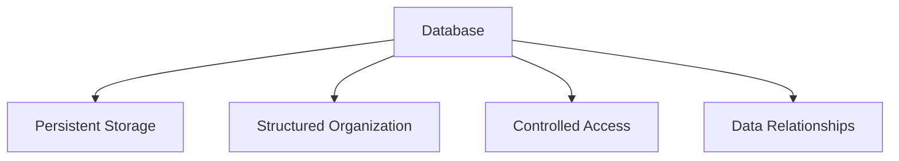

## Overview: Why Learn SQL?

SQL (Structured Query Language) is the standard language for interacting with relational databases. In today's data-driven world:

- 🔍 **Universal Usage**: Used by 99% of Fortune 500 companies
- 📈 **Career Growth**: #2 most in-demand tech skill (LinkedIn 2025)
- 💰 **High Value**: SQL developers earn 20-30% more than non-SQL peers
- 🔗 **Interoperability**: Works across all major database systems
- 🛠 **Versatility**: Essential for developers, analysts, scientists, and managers

SQL enables you to:
- Store and organize data efficiently
- Retrieve information with precision
- Transform raw data into business insights
- Build data-driven applications

---

## 1. Introduction to Databases

### What is a Database?
A database is an organized collection of structured information stored electronically in a computer system. Key characteristics:



### Relational vs. Non-Relational Databases

| Feature        | Relational (SQL)           | Non-Relational (NoSQL)      |
|---------------|---------------------------|----------------------------|
| **Structure**  | Tables with fixed schema   | Flexible document/key-value |
| **Scaling**    | Vertical                  | Horizontal                 |
| **Transactions**| ACID compliant           | BASE model                 |
| **Use Cases**  | Complex queries           | High velocity data         |
| **Examples**   | MySQL, PostgreSQL         | MongoDB, Cassandra         |

### Common Database Management Systems

1. **MySQL**
2. **PostgreSQL**
3. **SQL Server**
4. **Oracle**
### Database Schemas and Tables

```sql
-- Example schema creation
CREATE SCHEMA ecommerce;

-- Table structure example
CREATE TABLE ecommerce.users (
    user_id INT PRIMARY KEY,
    username VARCHAR(50) UNIQUE NOT NULL,
    email VARCHAR(255),
    signup_date DATE DEFAULT CURRENT_DATE
);
```

Key concepts:
- **Schema**: Container for database objects (tables, views, etc.)
- **Table**: Collection of related data in rows and columns
- **Column**: Attribute with specific data type
- **Row**: Single record in a table

