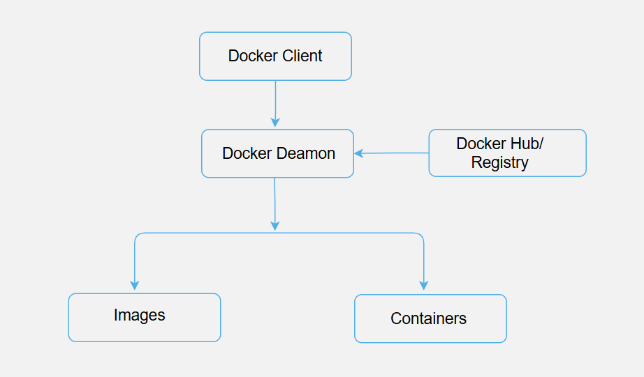

## Docker Architecture

The architecture of Docker explains how Docker works under the hood using a client-server architecture. If you’ve ever run a container with `docker run`, this guide will help you understand what’s happening behind the scenes.
Docker follows a client-server model where the Docker client talks to the Docker daemon, which handles building, running, and managing your containers.

## Docker Architecture Diagram


The diagram above shows how Docker components interact.

##  Docker Components

### 1. Docker Client

This is the Command Line Interface (CLI) tool where you run `docker build`, `docker run`, or `docker pull`.
### For Example:
```bash
docker run hello-world
```
This command is issued from the Docker Client. It sends a request to the Docker Daemon to run the hello-world container.

### 2. Docker Daemon (dockerd)
This background process receives requests from the client and handles container lifecycle: building images, starting/stopping containers, etc.

When the client sends `docker run hello-world`, the daemon:
* Checks if the image exists locally
* Pulls it from Docker Hub if needed
* Creates and runs a container from it

### 3. Docker Images
A Docker image is a read-only template that includes the application code, libraries, dependencies, etc.
### For Example, when you run:
```bash
docker pull python:3.10
```

This pulls a Python image from Docker Hub. You can then run a container from this image.

### 4. Docker Containers
A container is a runnable instance of an image. It is isolated and lightweight.
```bash
docker run -it python:3.10
```
This runs a Python shell in an isolated container.

### 5. Docker Registries (like Docker Hub)
Registries are storage and distribution systems for Docker images.
```bash
docker push yourname/myapp
```
This pushes a custom image to your Docker Hub account, making it available for others (or yourself) to pull from anywhere

 ## Real-World Analogy

Think of Docker as a shipping company:
- *Image*: A packaged good with instructions
- *Container*: A delivery truck carrying the good
- *Daemon*: The warehouse manager who dispatches trucks
- *Registry*: The storage depot of all packaged goods
- *Client*: The customer placing an order

## Summary of the Flow (Behind docker run)
1.	You run `docker run hello-world` on the Docker Client
2.	The Client sends the command to the Docker Daemon
3.	The Daemon checks local images
4.	If missing, it pulls from Docker Hub
5.	The Daemon uses the image to create and start a Container
6.	You see the container output on your terminal.


