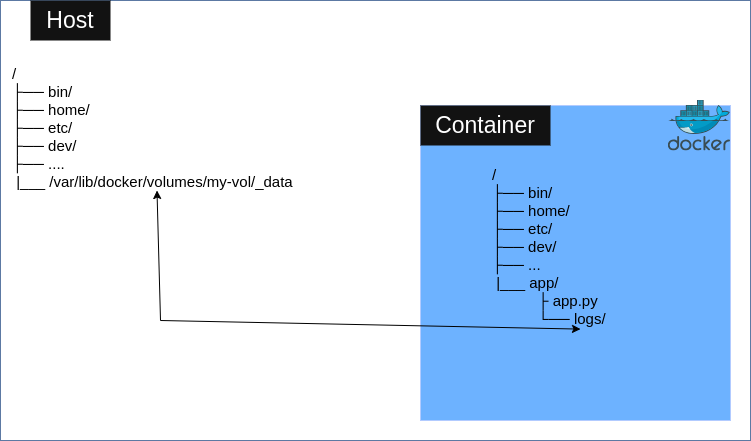
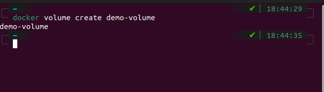
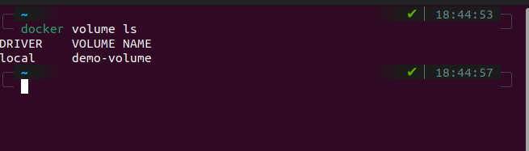
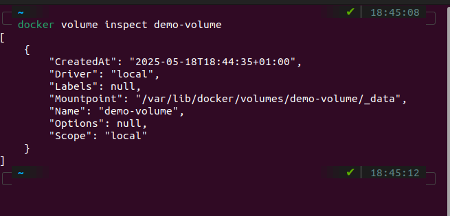
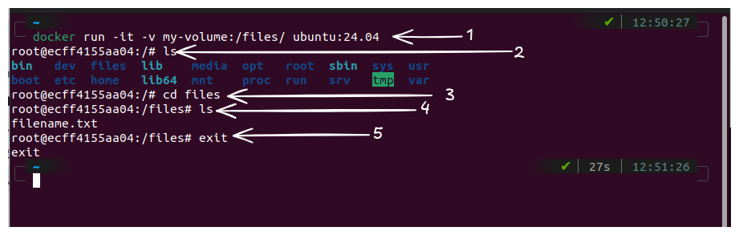

## Docker containers are not designed for long term storage

When you run an app inside a docker container, any data generated by the app inside the container is written inside file system of the container. 
However the filesystem of a docker container is not designed for any long term file storage. Any files that is generated inside the container while it is running is lost when the container crashes or accidentally removed.

Scenario: You have an app running inside a container. This app generates logs and writes it to a location inside the container e.g `/app/logs`. This is potentially useful information that you may want to use for other purposes. You need to protect these files from anyting that may happen to the container.

The point here is that You should never assume that anyting saved to the filesystem of a Docker Container today will be available in that container tomorrow. Always view the the file system of a container as a temporary storage location.   
Therefore you need to plan for any potential data loss that may occur due to writing data into a container's filesystem. This is where **DOCKER VOLUMES** come in.

## What is a Docker Volume?
A Docker volume is a persistent storage mechanism in Docker that allows you to store data that is generated inside a container to a location outside the container’s filesystem. Typically on the **HOST**. This ensures that the data is not lost when the container stops, restarts, or is removed.

> HOST: The machine that is running the Docker engine (i.e The machine that is creating the containers). It can be your local computer, virtual machine or a server on the cloud

## How volumes work
A Docker Volume in its essence is just a directory on the host filesystem that is mounted on a directory in a Docker Container.   

> **Volumes are managed by docker and stored in a docker managed location typically `/var/lib/docker/volumes/`**

The picture below illustrates this concept  

  

In the picture above, the directory `/app/logs/` in the container is mounted on `/var/lib/docker/volumes/my-vol/_data` on the host.    
Now any data that is written to `/app/logs` in the container will automatically be saved to `/var/lib/docker/volumes/my-vol/_data` on the host. 

## Common commands in docker volumes
**To create a volume on docker**  
```bash
docker volume create volume-name
```


**To see a list of all created volumes**  
```bash
docker volume ls
```
   

**To view the properties of a specific volume**  

```bash
docker volume inspect <volume-name>
```
  
**Here is a breakdown of the output**
| Field | Meaning | 
| - | - |
| "CreatedAt" | The date and time the volume was created | 
| "Driver": | Type of volume | 
| "Labels": | Optional metadata.  You can add labels using `--label` flag while creating the volume | 
| "Mountpoint" | Thelocation where Docker stores the data for this volume. NB:This location is not inside your container, it's on your system. |
| "Name" | The name of the volume | 
| "Options" |  |
| "Scope" |  | 

**To delete a volume**
```bash
docker volume rm <volume-name>
```

## Benefits of Docker Volumes
1. **Persistence Beyond Container Lifecycle**   
   Docker volumes are independent of the containers which they are attached to. This means that if you delete a container or if it crashes, the data stored in the mounted volume remains intact because the volume is stored on the host system outside of the container.    
   This behaviour is useful when you have
   + An app that generates data (e.g logs, photos, files, etc) that you dont want to lose.
   + An app that writes data to a databaase. When you mount the database to a Docker volume, you ensure that your data persists on the host.

2. **Data Sharing between containers**  
   Docker volume makes it very easy for container to share data with each other. You can mount the same volume into multiple container i.e All those containers will have access to the same data data even though they are running separately

## Illustration of Docker volumes
Let us look at a scenario where a volume is mapped to a directory in a container.     
For this illustration, we will be using an ubuntu image to create our container and we will map a volume to a directory on that container. The syntax below can be used achieve it

```bash
docker run -v <volume-name>:<container-path> <image-name>
```
Here is a breakdown of the command
+ `docker run` : This is the commandn used to create and start new container
+ `-v` : This tag tells docker to mount a volume into the container
+ `<volume-name>` - The name of the docker volume. If a volume with that name already exists, docker will use it. If a volume with 
that name does not exist, docker will create it
+ `<container-path>` - The path inside the container where the volume should be mounted on
+ `<image-name>` - The name of the image in which the container will be created from.


**Figure below demonstrates the workflow**   

   1. Start a container from **ubuntu:24.04** image and map a volume called **my-volume** to **/app/logs** inside the container
   2. Here, we are inside the container and we run `ls` to see a list of the directories in the root directory of the container
   3. Here, we change our directory to **/app/logs** i.e the directory that our volume is mounted on
   4. Here, we write a random file called **filename.txt** into that directory
   5. Here, we run `ls` to view the content of the folder and make sure that our **filename.txt** is there
   6. Here, we exit the container


To verify that the contents of the volume can be assessed from another container, we will create another container from the same image and mount a directory on that container to a volume in the container. Figure below demonstrates it


   1. Start a container from **ubuntu:24.04** image and map a volume called `myvolume` to `/files` inside the container
   2. Here, we are inside the container and we run `ls` to view the content of the root directory of the container
   3. Here, We cd into `/files` i.e the directory that our volume is mounted on
   4. We list the content of that directory.   
      As you can see, the file that was written into the volume via the first container still exists
   5. Exit the container

> NOTE: When any or all of the containers get deleted, the volume still exists and accessing its contents is as simple as spinning up a new container and mounting that volume to a directory in the new container.

## Volume Modes

By default, all containers that are mounted to a Docker volume can read from and write to that volume simultaneously (you can write data to the volume from one container and delete or modify its contents from another container at the same time). If not managed properly, this default behavior can lead to unintended conflicts or corruption of data. 

In order to control how containers interact with volumes, you can specify the mode in which your volume should be mounted on the container. 
+ **Read-Write (`rw`)** : This is the default mode. When you mount a volume using the read-write mode, the container will be able to read data from and write data to the volume. This should be used when you want to have full access to data inside the volume.

+ **Read-Only (`ro`)**: With this mode, containers can only read data from the vlume but cannot modify or delete it. This is useful if you want to share data betweeen containers without risking any accidental changes.

#### Syntax

When running a container, you can specify the mode using this syntax:

```bash
docker run -v <volume-name>:<container-path>:<mode> <image-name>
```
> Replace `<mode>` with `ro` for read-only or `rw` for read-write.

Fore example
```bash
docker run -it -v mydata:/app/data:ro ubuntu
```

This mounts the `mydata` volume to `/app/data` inside the container as read-only and when you try to write data to `/app/data` inside the container, you will get an error.


