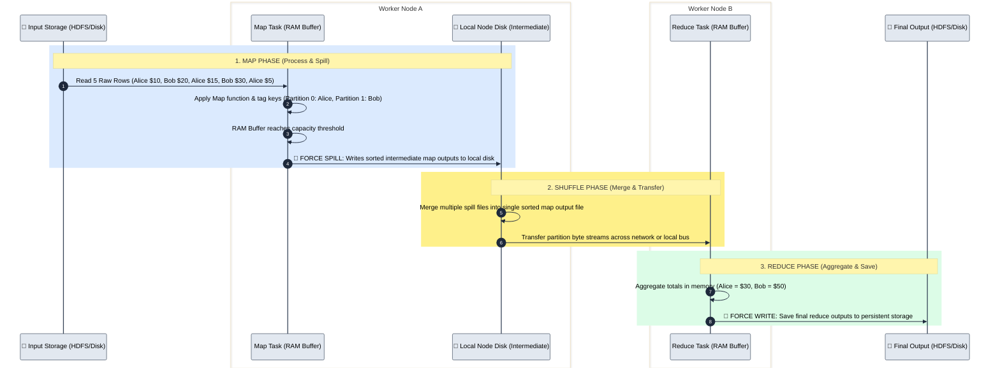

# MapReduce

As data continued to grow, scaling a single machine was no longer enough. The industry needed a way to process massive datasets across multiple machines instead of relying on one powerful server.

This led to the creation of Hadoop, an ecosystem designed for distributed storage and distributed processing.

You can think of Hadoop as the parent ecosystem that provides the infrastructure for handling big data. Within the Hadoop ecosystem, MapReduce serves as the processing framework responsible for executing data processing jobs across a cluster of machines.

A simplified view of the Hadoop ecosystem looks like this:

- HDFS (Storage)
- YARN (Resource Management)
- MapReduce (Processing)

MapReduce was one of the first widely adopted distributed processing frameworks and played a major role in the growth of big data technologies.

## How MapReduce Solved the Single-Node Problem

MapReduce breaks a job into two main phases:

### Map Phase

The input data is divided into smaller chunks and distributed across multiple nodes. Each node processes its assigned portion of the data independently.

### Reduce Phase

The intermediate results produced during the Map phase are collected, grouped, and combined to produce the final result.

This approach allowed organizations to process terabytes and petabytes of data that would have been impossible to handle on a single machine.

Instead of processing a 10 TB dataset on one machine, MapReduce distributes the workload across multiple nodes, allowing each machine to process only a fraction of the data. This significantly reduces the memory pressure on any single node and enables large-scale distributed processing.

### Limitations of MapReduce

While MapReduce introduced distributed processing to the world of big data, it had several limitations:

- Slow execution speed – Processing could become slow, especially for complex workloads involving multiple stages.

- Heavy reliance on disk storage – Intermediate results were frequently written to disk rather than kept in memory.

- High Disk I/O overhead – Constant reading from and writing to disk increased processing time and reduced overall performance.

- Disk-bound architecture – Performance was largely constrained by disk access speeds, which are significantly slower than memory access speeds.

- Complex development experience – Building and maintaining MapReduce jobs often required a significant amount of code, making development more challenging.

- Primarily Java-based programming model – Developers familiar with Python, SQL, or R often faced a steep learning curve when working with MapReduce.

As organizations processed increasingly larger datasets, they needed a system that could reduce disk operations, make better use of memory, provide better performance and support more developer friendly programming languages.

These needs eventually led to the creation of Apache Spark.

### 💾 Classic MapReduce: Intermediate Disk I/O Flow

In classic **Hadoop MapReduce**, intermediate data is forcibly written to physical disk at multiple stages, making chained operations heavily disk-bound compared to Spark's in-memory pipelining.

## 📖 At What Points Does MapReduce Save Data to Disk?
Using our 5-row dataset (Alice: $10, $15, $5 and Bob: $20, $30), here is the exact timeline of disk writes:

### Point 1: The In-Memory Buffer Spill (Map Side Local Disk Write)
- In-Memory Buffering: As Map tasks process the 5 rows, records are written into an in-memory ring buffer (typically 100MB by default).

- The Spill Threshold: When the buffer reaches its threshold (e.g., 80% full), a background thread wakes up, sorts the data in memory by Partition ID, and forces a write (spill) to the node's local disk.

- Merge File Write: Before the Map phase completes, all individual spill files on disk are merged into a single sorted intermediate file on local disk along with an index file.

### Point 2: The Final Output Write (Reduce Side Storage Write)
- Network Transfer & Merge: Reduce tasks fetch their partition blocks from the local disk of Map nodes and sort/merge them.

- Final Aggregation & Hard Write: Reduce tasks calculate the final sum (Alice = $30, Bob = $50) and forcibly write the final output directly back to persistent storage (HDFS/S3).

### 🔑 The Key Takeaway vs. Spark

`Hadoop MapReduce:` Every single MapReduce job must end by writing its final result to hard disk storage. If you want to run a second operation on the output (like a .filter()), MapReduce must launch a brand new job that reads those files off disk all over again.

`Apache Spark:` Spark holds intermediate Map results in RAM, pipelines narrow transformations continuously without writing to disk, and only uses local disk buffering when crossing a Shuffle stage boundary or running out of RAM.
