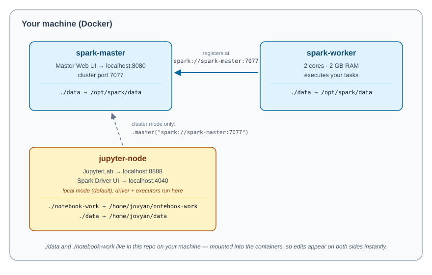

# Spark Dev Environment: Student Setup Guide

Welcome! This repository gives you a complete, local Apache Spark development environment using Docker. In about 10 minutes you will have:

- A **Spark standalone cluster** (one master + one worker) running in containers
- A **JupyterLab** instance with PySpark pre-installed, ready to run notebooks
- **Sample datasets** (orders and products CSVs) to practice with
- A **demo notebook** showing how to read data and inspect Spark's query plans

No local installation of Spark, Java, or Python is required — Docker handles everything.

---

## Table of Contents

1. [What You're Building](#1-what-youre-building)
2. [Prerequisites](#2-prerequisites)
3. [Getting the Code](#3-getting-the-code)
4. [Starting the Environment](#4-starting-the-environment)
5. [Verifying Everything Works](#5-verifying-everything-works)
6. [Opening JupyterLab and Running Your First Notebook](#6-opening-jupyterlab-and-running-your-first-notebook)
7. [Understanding the Setup (How the Pieces Fit Together)](#7-understanding-the-setup-how-the-pieces-fit-together)
8. [Local Mode vs. Cluster Mode](#8-local-mode-vs-cluster-mode)
9. [Working with the Sample Data](#9-working-with-the-sample-data)
10. [Stopping, Restarting, and Cleaning Up](#10-stopping-restarting-and-cleaning-up)
11. [Troubleshooting](#11-troubleshooting)

---

## 1. What You're Building

The environment is defined in a single file, `docker-compose.yaml`, and consists of three containers:

| Container | Image | Role | Ports on your machine |
|---|---|---|---|
| `spark-master` | `apache/spark:latest` | Coordinates the cluster; hosts the Master Web UI | `8080` (Web UI), `7077` (cluster communication) |
| `spark-worker` | `apache/spark:latest` | Executes tasks; registers itself with the master | — |
| `jupyter-node` | `jupyter/pyspark-notebook:latest` | Your workspace: JupyterLab with PySpark installed | `8888` (JupyterLab), `4040` (Spark Driver UI) |

A picture of the layout:




The repository folders you'll interact with:

```
spark-dev-environment/
├── docker-compose.yaml     # Defines the three containers
├── notebook-work/          # Your notebooks live here (saved on your machine)
│   └── demo.ipynb          # A starter notebook
└── data/                   # Datasets shared with every container
    └── bucketing/
        ├── orders.csv      # 1,000 sample orders
        └── products.csv    # 100 sample products
```

Because `notebook-work/` and `data/` are **mounted volumes**, anything you save in a notebook persists on your machine even after the containers are stopped or deleted.

---

## 2. Prerequisites

You need exactly one thing installed: **Docker with Docker Compose**.

### Windows / macOS
Install [Docker Desktop](https://www.docker.com/products/docker-desktop/). Docker Compose is included.

- **Windows users:** Docker Desktop requires WSL 2. The installer will prompt you to enable it if it isn't already.
- **macOS Apple Silicon (M1/M2/M3) users:** both images used here publish ARM builds, so this works natively — no special steps needed.

### Linux
Install Docker Engine and the Compose plugin following the [official instructions](https://docs.docker.com/engine/install/). Then add yourself to the `docker` group so you don't need `sudo` for every command:

```bash
sudo usermod -aG docker $USER
# log out and back in for this to take effect
```

### Verify your installation

```bash
docker --version
docker compose version
```

Both commands should print a version number. If `docker compose` (with a space) fails but `docker-compose` (with a hyphen) works, you have the older standalone Compose — that's fine, just substitute `docker-compose` wherever this guide says `docker compose`.

### Resources
Give Docker at least **4 GB of RAM** (Docker Desktop → Settings → Resources). The worker alone is configured for 2 GB, and Jupyter needs headroom too.

---

## 3. Getting the Code

Clone the repository and move into it:

```bash
git clone <REPOSITORY_URL>
cd spark-dev-environment
```

(If your instructor gave you a zip file instead, unzip it and `cd` into the extracted folder.)

Every command in the rest of this guide assumes you are inside the `spark-dev-environment` directory — the one containing `docker-compose.yaml`.

---

## 4. Starting the Environment

One command starts everything:

```bash
docker compose up -d
```

What happens:

1. Docker downloads two images the first time: `apache/spark:latest` (~1 GB) and `jupyter/pyspark-notebook:latest` (~4 GB). **The first start can take 5–15 minutes depending on your internet connection.** Subsequent starts take seconds because the images are cached.
2. Docker creates and starts the three containers.
3. The `-d` flag ("detached") returns you to your prompt while the containers run in the background.

You should end with output similar to:

```
✔ Container spark-master  Started
✔ Container spark-worker  Started
✔ Container jupyter-node  Started
```

---

## 5. Verifying Everything Works

### Step 1 — Check the containers are running

```bash
docker compose ps
```

You should see all three containers with `STATUS` of `Up`:

```
NAME           IMAGE                              STATUS
jupyter-node   jupyter/pyspark-notebook:latest    Up
spark-master   apache/spark:latest                Up
spark-worker   apache/spark:latest                Up
```

If any container shows `Exited`, jump to [Troubleshooting](#11-troubleshooting).

### Step 2 — Open the Spark Master Web UI

Open **http://localhost:8080** in your browser. You should see the Spark Master page with:

- A URL at the top reading `spark://spark-master:7077`
- **Workers (1)** — one worker listed as `ALIVE`, with 2 cores and 2 GB of memory

If the worker shows up as ALIVE, your cluster is healthy. 🎉

### Step 3 — Open JupyterLab

Open **http://localhost:8888**. JupyterLab should load directly with **no login screen** (authentication is intentionally disabled for this local setup — see the security note below). In the file browser on the left you'll see two folders: `notebook-work` and `data`.

> ⚠️ **Security note:** Jupyter's token and password are disabled in `docker-compose.yaml` to make the classroom experience friction-free. This is fine on your own laptop, but **never expose port 8888 to a network or the internet with this configuration.**

---

## 6. Opening JupyterLab and Running Your First Notebook

1. In JupyterLab's file browser, open `notebook-work/demo.ipynb`.
2. Run the cells in order (`Shift + Enter` runs a cell and moves to the next one).

The notebook does three things:

**Cell 1 — Import:**
```python
from pyspark.sql import SparkSession
```

**Cell 2 — Create a Spark session:**
```python
spark = SparkSession.builder \
    .appName("ReadCSV") \
    .getOrCreate()
```
The first run takes ~15–30 seconds while the JVM starts. When it finishes, a Spark driver is running inside the Jupyter container — you can watch it at **http://localhost:4040** (the Spark Driver UI, only available while a session is active).

**Cell 3 — Read a CSV and inspect the plan:**
```python
file_path = "../data/bucketing/orders.csv"

df = spark.read.format("csv") \
    .option("header", "true") \
    .option("inferSchema", "true") \
    .load(file_path)

df.printSchema()
df.show(5)
df.explain(True)
```

A few things worth understanding here:

- **The path `../data/...`** is relative to the notebook's location (`/home/jovyan/notebook-work` inside the container), so it resolves to `/home/jovyan/data/bucketing/orders.csv` — the `data/` folder from this repo, mounted into the container.
- **`inferSchema=true`** makes Spark scan the file to guess column types (so `order_id` becomes an integer, not a string). Convenient for learning; in production you'd usually declare an explicit schema.
- **`df.explain(True)`** prints the four stages of Spark's query planning: the Parsed, Analyzed, and Optimized logical plans, and the final Physical Plan. Getting comfortable reading these plans is one of the most valuable Spark skills you'll build in this course.

Try adding a new cell and running:

```python
df.groupBy("customer_id").sum("total_amount").show(10)
```

When you're done experimenting, stop the Spark session to free memory:

```python
spark.stop()
```

---

## 7. Understanding the Setup (How the Pieces Fit Together)

Open `docker-compose.yaml` and read along — every line matters.

### The master

```yaml
spark-master:
  image: apache/spark:latest
  hostname: spark-master
  ports:
    - "8080:8080"   # Master Web UI
    - "7077:7077"   # Spark Master communication
  command: /opt/spark/bin/spark-class org.apache.spark.deploy.master.Master
```

This runs Spark's **standalone Master** process. Port `7077` is where workers (and applications) connect; port `8080` is the human-facing dashboard. The `hostname: spark-master` line is what lets other containers reach it by name at `spark://spark-master:7077` — Docker Compose puts all three containers on a shared network with automatic DNS.

### The worker

```yaml
spark-worker:
  depends_on:
    - spark-master
  command: /opt/spark/bin/spark-class org.apache.spark.deploy.worker.Worker spark://spark-master:7077
  environment:
    - SPARK_WORKER_CORES=2
    - SPARK_WORKER_MEMORY=2g
```

The worker starts after the master (`depends_on`) and registers with it, offering **2 CPU cores and 2 GB of memory** for running tasks. Want a bigger cluster? You can scale workers with `docker compose up -d --scale spark-worker=3` (remove the `container_name` line first — container names must be unique).

### The notebook

```yaml
jupyter:
  image: jupyter/pyspark-notebook:latest
  ports:
    - "8888:8888"   # JupyterLab
    - "4040:4040"   # Spark Driver UI
  volumes:
    - ./notebook-work:/home/jovyan/notebook-work
    - ./data:/home/jovyan/data
```

`jovyan` is the default user in all Jupyter Docker images (a play on "Jovian" — of Jupiter). The two volume mounts are the bridge between your machine and the container: edit a CSV in `data/` on your laptop and the container sees the change instantly, and vice versa.

### The shared `data/` volume

Notice that **all three containers** mount `./data`, but at different paths:

| Container | Path to the data |
|---|---|
| `jupyter-node` | `/home/jovyan/data` |
| `spark-master` | `/opt/spark/data` |
| `spark-worker` | `/opt/spark/data` |

This matters the moment you run in cluster mode — read on.

---

## 8. Local Mode vs. Cluster Mode

This is the most important conceptual point in this environment, and a common source of confusion.

### Local mode (what the demo notebook uses)

```python
spark = SparkSession.builder.appName("ReadCSV").getOrCreate()
```

No `.master(...)` is specified, so Spark defaults to **`local[*]` mode**: the driver *and* the executors all run inside the `jupyter-node` container, using its CPUs. The `spark-master` and `spark-worker` containers are **not involved at all** — check http://localhost:8080 while the notebook runs and you'll see zero running applications.

Local mode is perfect for learning DataFrame APIs, and it's what you should use for most exercises in this course.

### Cluster mode (submitting work to the standalone cluster)

To actually use the cluster, point the session at the master:

```python
spark = SparkSession.builder \
    .appName("ClusterDemo") \
    .master("spark://spark-master:7077") \
    .getOrCreate()
```

Now the driver runs in Jupyter, but tasks execute on the **worker**. Refresh http://localhost:8080 and you'll see your application listed under "Running Applications".

Two gotchas when running in cluster mode:

1. **File paths must make sense to the executors, not just the driver.** The worker sees the data at `/opt/spark/data/...`, while Jupyter sees it at `/home/jovyan/data/...`. A path like `../data/bucketing/orders.csv` works in local mode but will fail with `FileNotFoundException` in cluster mode, because the worker doesn't have that path. In real deployments this is solved with shared storage (S3, GCS, HDFS); here, be aware of it and prefer local mode for file-based exercises.
2. **Version alignment.** The Jupyter image and the Spark images are pulled independently and both use the `latest` tag, so their Spark/Python versions can drift apart over time. If you see errors about incompatible versions when connecting to the cluster, this is why — your instructor may pin specific image tags in `docker-compose.yaml` to avoid it.

**Rule of thumb for this course:** use local mode for the exercises; use cluster mode when the lesson is specifically about cluster behavior (the UIs, task distribution, resource allocation).

---

## 9. Working with the Sample Data

The `data/bucketing/` folder contains two related datasets, sized to be joined:

**`orders.csv`** — 1,000 orders:

| column | type | example |
|---|---|---|
| `order_id` | int | 1 |
| `product_id` | int | 80 |
| `customer_id` | int | 10 |
| `quantity` | int | 4 |
| `order_date` | date string | 2023-3-20 |
| `total_amount` | int | 1003 |

**`products.csv`** — 100 products:

| column | type | example |
|---|---|---|
| `product_id` | int | 1 |
| `product_name` | string | Product_1 |
| `category` | string | Electronics |
| `brand` | string | Brand_4 |
| `price` | int | 26 |
| `stock` | int | 505 |

A natural first exercise — join them and study the plan:

```python
orders = spark.read.option("header", True).option("inferSchema", True) \
    .csv("../data/bucketing/orders.csv")
products = spark.read.option("header", True).option("inferSchema", True) \
    .csv("../data/bucketing/products.csv")

revenue_by_category = orders.join(products, "product_id") \
    .groupBy("category") \
    .sum("total_amount") \
    .orderBy("sum(total_amount)", ascending=False)

revenue_by_category.show()
revenue_by_category.explain(True)
```

Look at the physical plan: with a 100-row products table, Spark chooses a **broadcast hash join** (it ships the small table to every executor rather than shuffling both sides). The folder is named `bucketing` because these datasets are also used later in the course to demonstrate bucketed joins — where pre-sorting data into buckets by join key avoids the shuffle entirely.

Feel free to add your own datasets under `data/` — they'll appear inside the containers automatically.

---

## 10. Stopping, Restarting, and Cleaning Up

| What you want | Command | Effect |
|---|---|---|
| Pause for the day | `docker compose stop` | Containers stop but are kept; `docker compose start` resumes them quickly |
| Shut down properly | `docker compose down` | Containers and network are removed. **Your notebooks and data are safe** — they live in this repo's folders, not in the containers |
| Restart after editing `docker-compose.yaml` | `docker compose up -d` | Recreates only the containers whose configuration changed |
| Watch what a container is doing | `docker compose logs -f jupyter` | Streams that container's logs (`Ctrl+C` to stop watching) |
| Reclaim disk space at the end of the course | `docker compose down` then `docker image rm apache/spark:latest jupyter/pyspark-notebook:latest` | Removes the ~5 GB of downloaded images |

---

## 11. Troubleshooting

### "port is already allocated" when starting
Something on your machine already uses port 8080, 8888, 7077, or 4040. Find and stop it, or change the *left-hand* side of the port mapping in `docker-compose.yaml` (e.g. `"9090:8080"` publishes the Master UI on http://localhost:9090 instead). Left side = your machine, right side = inside the container; only change the left.

### http://localhost:8888 shows a token/login page
The `command:` override in `docker-compose.yaml` may not have applied. Recreate the container:
```bash
docker compose up -d --force-recreate jupyter
```
Alternatively, get a login token from the logs: `docker compose logs jupyter | grep token`.

### Worker doesn't appear on the Master UI
Check the worker's logs for connection errors:
```bash
docker compose logs spark-worker
```
Usually the worker just started before the master finished booting. Restart it: `docker compose restart spark-worker`.

### `FileNotFoundException` when reading a CSV
- In **local mode**, check the path from the notebook's point of view: notebooks in `notebook-work/` reach the data via `../data/...` (or the absolute path `/home/jovyan/data/...`).
- In **cluster mode**, remember the workers see the data at `/opt/spark/data/...` — see [Section 8](#8-local-mode-vs-cluster-mode).

### Cells hang or the kernel dies when creating a SparkSession
Docker likely doesn't have enough memory. Increase Docker Desktop's memory allocation to at least 4 GB (Settings → Resources), then `docker compose restart`.

### "Cannot connect to the Docker daemon"
Docker isn't running. Start Docker Desktop (Windows/macOS) or `sudo systemctl start docker` (Linux).

### Everything is broken and you want a clean slate
```bash
docker compose down
docker compose up -d --force-recreate
```
Your notebooks and data are untouched — they live on your machine, not in the containers.

---

## You're Ready

At this point you have a working Spark cluster, a notebook environment, and sample data. The workflow for the rest of the course is simply:

1. `docker compose up -d`
2. Open http://localhost:8888 and work in `notebook-work/`
3. `docker compose stop` when you're done

Happy Sparking! ⚡
